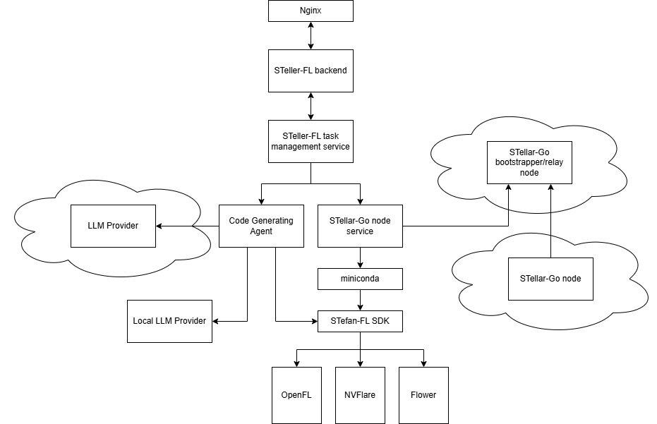
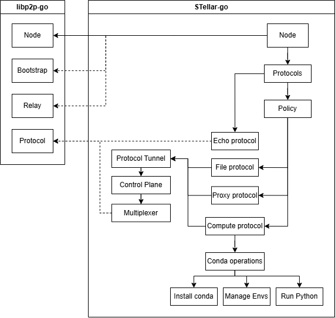
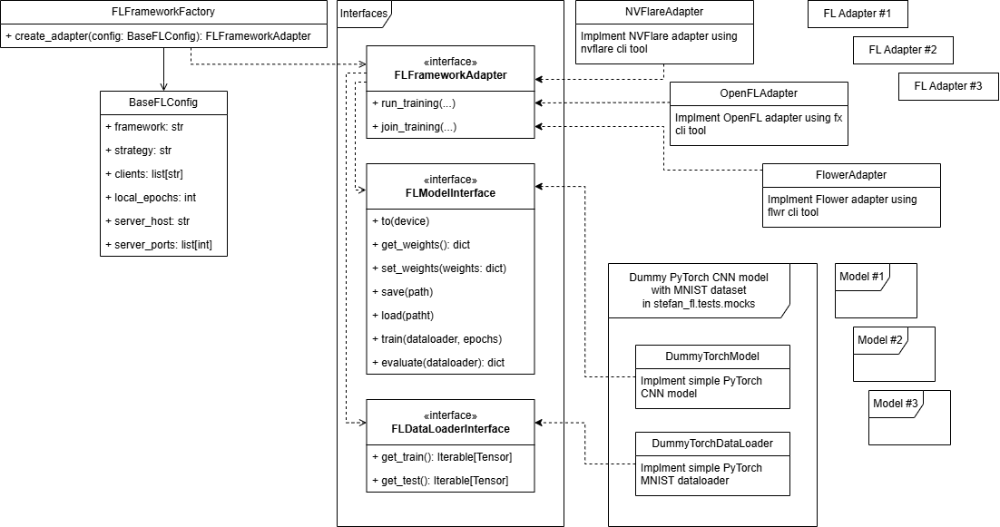

# STellar-FL

**STellar-FL** is a decentralized federated learning orchestration service for cross-institution training under network-constrained environments. It combines a central orchestration API (FastAPI + Celery), the **stellar-go** P2P layer for device discovery and execution, and the **stefan-fl** SDK to run FL tasks with frameworks such as NVFlare, OpenFL, and Flower. Communications between the existing FL framework components (server and clients) are **tunneled via a P2P reverse-proxy**, so deployment does not require public IPs, port forwarding, or VPNs, and reduces cybersecurity exposure.

---

## Architecture and workflow (top-to-bottom)

The system is designed in three main parts: **federated training orchestration** (STellar-FL and STefan-FL), a **distributed communication layer** (STellar-Go), and **federated execution nodes**. The diagram below shows how they connect.



### Two distinct concerns

**1. FL task process — distribution and distributed execution**

The **FL task process** is what runs when a training job is submitted. It focuses solely on:

- **Distributing the FL task** via **stellar-go**: the orchestration service discovers devices through the P2P layer (bootstrapper/relay), distributes workspaces (e.g. code and config) to remote nodes, and coordinates which nodes participate.
- **Tunneling FL framework traffic** via **P2P reverse-proxy**: traffic between the FL server and FL clients (e.g. Flower, NVFlare, OpenFL) is tunneled over the P2P network instead of using direct TCP connections. This avoids the need for public IPs, port forwarding, or opening inbound ports on institutional firewalls, and reduces cybersecurity concerns associated with exposed endpoints.
- **Executing on remote nodes** using **miniconda** (or similar) and **stefan-fl**: each federated execution node runs a managed environment (Conda) in which the **STefan-FL SDK** executes the chosen FL framework. Local model updates and training state are synchronized through the communication layer (including the proxy tunnel) and the FL orchestration workflow.

So end-to-end: the backend creates a task → task management coordinates with the **stellar-go node service** → the node service uses the P2P network (and bootstrapper/relay) to discover nodes, push workspaces, and trigger execution → on each node, **miniconda** and **stefan-fl** run the FL client (and optionally the server runs locally under orchestration). No centralized aggregation server; model parameters and training state are exchanged through distributed communication channels.

**2. Code-generating agent (LLM) — isolated from the FL task path**

The **code-generating agent** (optionally backed by an LLM provider or local LLM) is a separate development-time component. It uses **STefan-FL** as a **unified API/SDK** to produce FL-capable model and training code. This isolation gives:

- **Unified interface**: Model and data loading are decoupled from the underlying FL infrastructure through well-defined contracts (e.g. model and dataloader callables). The agent generates code that conforms to these contracts without handling framework-specific APIs or deployment details.
- **Better development and error reporting**: The small, deterministic surface area of STefan-FL makes it easier to validate and debug agent-generated code. Scripts can be checked via **simulation mode** (local or simulated FL runs) before being used in cross-institution training, reducing the risk of runtime failures in distributed settings.

So the LLM/agent is an **extension point** on top of STefan-FL: it benefits from the same unified workflow and adapter-based design that the rest of the system uses, but it is **not** part of the core FL task distribution and execution path.

### Design reasons (from architecture draft)

- **Decentralized topology**: Participating institutions operate autonomous nodes. The system supports dynamic node participation and does not require persistent direct connections between all peers, allowing deployment across heterogeneous network environments.
- **Firewall-compatible communication and P2P reverse-proxy**: STellar-FL uses relay-assisted communication and outbound connections from private networks. FL framework traffic between nodes is tunneled through a **reverse-proxy over P2P**: the existing FL server and clients communicate via proxy connections established through the stellar-go layer, so no direct inbound access, public IPs, port forwarding, or VPN setup is required. This design reduces cybersecurity exposure (no open ports or exposed endpoints on institutional networks) while keeping the underlying FL frameworks unchanged.
- **Unified FL workflow**: STefan-FL standardizes model implementation, data loading, and training execution across backends. The adapter-based design abstracts NVFlare, OpenFL, and Flower behind a single abstraction layer and consistent entry points, reducing engineering overhead and improving reproducibility.
- **LLM-assisted extensibility**: The same unified interface that simplifies deployment also creates a natural extension point for LLM-assisted development: generated code targets a small, well-defined contract and can be validated in simulation before being deployed via the same distribution and execution path.

---

## STellar-Go (distributed communication layer)

STellar-Go provides the decentralized network that orchestration uses for device discovery, file transfer, proxy, and remote compute. It sits on top of libp2p and adds protocols and Conda-based execution.



**libp2p-go (left)** supplies the base: **Node**, **Bootstrap**, **Relay**, and a generic **Protocol** layer. Nodes use bootstrap and relay to discover peers and connect across NATs.

**STellar-go (right)** adds:

- **Protocol tunnel**, **control plane**, and **multiplexer** between libp2p and STellar-go’s own protocols.
- **Protocols**: **Echo** (connectivity checks), **File** (transfer workspace/data), **Proxy** (reverse-proxy over P2P to tunnel FL framework traffic between server and clients), **Compute** (remote run). The proxy protocol tunnels communications for the existing FL frameworks (Flower, NVFlare, OpenFL) between nodes so that deployment avoids public IPs, port forwarding, and open inbound ports, addressing cybersecurity concerns in institutional environments.
- **Policy** for access and behavior rules.
- **Compute protocol → Conda operations**: install Conda, manage envs, and **run Python** in those envs so FL client code (e.g. Flower) runs in a controlled environment on each node.

The communication layer supports firewall-compatible channels, relay-assisted peer connectivity, and distributed task synchronization. A **reverse-proxy over P2P** tunnels FL framework traffic (e.g. gRPC, REST) between the FL server and clients so that the frameworks run unchanged while all traffic flows over the P2P network. Institutional nodes establish outbound connections to relay and proxy services; no public IPs, port forwarding, or inbound network exposure is required, reducing cybersecurity risks (no exposed FL endpoints on institutional firewalls).

---

## STefan-FL (unified FL orchestration and SDK)

STefan-FL is the SDK that turns orchestration intent into framework-specific FL runs. It defines common interfaces and adapters so multiple frameworks and model/dataloader implementations can be used without changing the rest of the stack. It serves both the **code-generating agent** (unified API for development and error reporting) and the **FL task process** (execution on orchestration and remote nodes).



**Interfaces**

- **FLFrameworkAdapter** — one adapter per FL framework (e.g. Flower, OpenFL, NVFlare); same high-level operations (rounds, clients, aggregation) regardless of framework.
- **FLModelInterface** — contract for models (parameters, train/eval steps).
- **FLDataLoaderInterface** — contract for client-side data loading.

**Configuration and factory**

- **FLFrameworkFactory** builds the right **FLFrameworkAdapter** from **BaseFLConfig** (rounds, clients, learning rate, etc.).

**Adapters and implementations**

- **NVFlareAdapter**, **OpenFLAdapter**, **FlowerAdapter** implement **FLFrameworkAdapter** for each framework.
- Models (e.g. dummy PyTorch CNN for MNIST in tests/mocks) implement **FLModelInterface**; data loaders (e.g. **DummyTorchDataLoader**) implement **FLDataLoaderInterface**.

By separating model implementation from execution infrastructure, the framework enables flexible deployment across heterogeneous environments and improves compatibility with existing FL ecosystems. The unified workflow reduces configuration complexity and supports simulation and automated testing for model development.

---

## What’s in this repository

- **`stellar/`** — Orchestration: FastAPI app, Celery worker, Redis-backed task state. Creates tasks, discovers devices via stellar-client, runs the FL server locally and FL clients on remote stellar-go nodes (compute + proxy), and streams logs and metrics.
- **`stellar-go/`** — P2P node, bootstrap/relay, file/proxy/compute protocols, Unix socket and HTTP API, and the **stellar-client** Python package. See [stellar-go/README.md](stellar-go/README.md).
- **`stefan-fl/`** — FL workflow: adapters for Flower, NVFlare, OpenFL; simulation and distributed modes; CLI. See [stefan-fl/README.md](stefan-fl/README.md).

Use the repo as a single tree; stellar-go and stefan-fl are expected to be present (no separate submodule clone).

---

## Prerequisites

- **Python 3.11+**, **Redis** (Celery broker and task state), **Go 1.24+** (only if building the stellar binary).
- For distributed FL: one or more **stellar-go** nodes and at least one bootstrap/relay node with `bootstrappers.txt` configured.
- For Docker: **Docker** (20.10+), **Docker Compose**; optionally **NVIDIA driver + Container Toolkit** for GPU.

---

## Project layout

```
.
├── stellar/              # Orchestration (FastAPI, Celery, task state)
├── stellar-go/            # P2P node + stellar-client
├── stefan-fl/             # Unified FL workflow (adapters, CLI)
├── docs/images/           # Architecture diagrams
├── Dockerfile
├── docker-compose.yml
└── ...
```

See `docker-compose.yml`, `Dockerfile`, and [STELLAR_SERVER_DOCUMENTATION.md](STELLAR_SERVER_DOCUMENTATION.md) for run and API details.

## License

See the [LICENSE](LICENSE) file in this repository.
